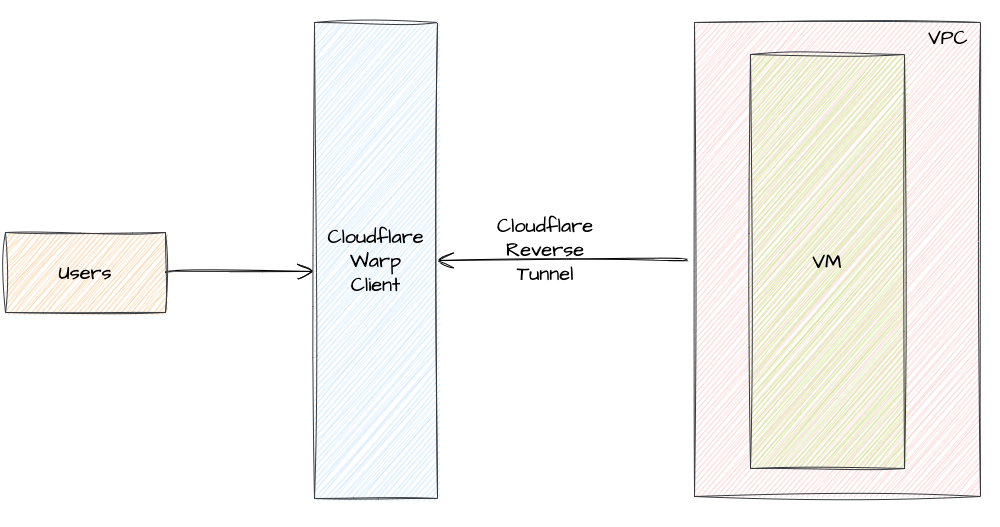

# cloudflare-warp-gcp



## Steps
- Initial Export
- Network Setup
  - Vpc
  - Subnet
  - Firewall
- Create Nat gateway
  - Route
  - Nat
- Create Instance Group
- Create Internal Load Balancer
  - Health-checks
  - Backend-service
  - Frontend-service
- Setup cloudflare account
- Install Warp Client -  [https://1.1.1.1/](https://1.1.1.1/)
- Configure Cloudflare Tunnel
- Create Instance

## Initial Export
```shell
export PROJECT_ID="teak-component-380801"
export REGION="europe-west4"
export ZONE="europe-west4-a"
export NETWORK="internal-vpc-1"
export SUBNET="internal-subnet-1"
export INSTANCE_NAME="instance-1"
export IP_RANGE="172.19.0.0/20"
```

## Network Setup
```shell
gcloud config set project ${PROJECT_ID}

gcloud compute networks create ${NETWORK} --project=${PROJECT_ID} --subnet-mode=custom --mtu=1460 --bgp-routing-mode=regional

gcloud compute networks subnets create ${SUBNET} --project=${PROJECT_ID} --range=${IP_RANGE} --stack-type=IPV4_ONLY --network=${NETWORK} --region=${REGION} --enable-private-ip-google-access

gcloud compute networks subnets create internal-lb-proxy --purpose=REGIONAL_MANAGED_PROXY --role=ACTIVE --region=${REGION} --network=${NETWORK}  --range="172.21.0.0/20"

gcloud compute firewall-rules create ${NETWORK}-allow-icmp --network=${NETWORK} --allow tcp,udp,icmp --source-ranges=${IP_RANGE}

gcloud compute firewall-rules create ${NETWORK}-allow-ssh --network=${NETWORK} --allow tcp:22,icmp

gcloud compute firewall-rules create ${NETWORK}-allow-80 --direction=INGRESS --priority=1000 --network=${NETWORK} --action=ALLOW --rules=tcp:80
```

## Create Nat Gateway
```shell
gcloud compute routers create internet-router --network=${NETWORK} --region=${REGION} --asn=65001 --advertisement-mode=CUSTOM

gcloud compute routers nats create internet-nat-gateway --router=internet-router --nat-all-subnet-ip-ranges --auto-allocate-nat-external-ips --region=${REGION}
```

## Instance Check
```shell
gcloud compute instances create ${INSTANCE_NAME} --project=${PROJECT_ID} --zone=${ZONE} --machine-type=c3-highcpu-4 --network-interface=network-tier=PREMIUM,nic-type=GVNIC,subnet=${SUBNET},no-address --maintenance-policy=MIGRATE --provisioning-model=STANDARD --service-account=728919999622-compute@developer.gserviceaccount.com --scopes=https://www.googleapis.com/auth/cloud-platform --create-disk=auto-delete=yes,boot=yes,device-name=${INSTANCE_NAME},image=projects/debian-cloud/global/images/debian-11-bullseye-v20230306,mode=rw,size=10,type=projects/${PROJECT_ID}/zones/${ZONE}/diskTypes/pd-balanced --no-shielded-secure-boot --shielded-vtpm --shielded-integrity-monitoring --labels=ec-src=vm_add-gcloud --reservation-affinity=any
```

## SSH Command
```
gcloud compute ssh --zone="${ZONE}" ${INSTANCE_NAME}  --tunnel-through-iap --project=${PROJECT_ID}
```

## Create Instance Group
```shell
gcloud compute instance-groups unmanaged create instance-group-1 --project=${PROJECT_ID} --zone=${ZONE}

gcloud compute instance-groups unmanaged add-instances instance-group-1 --project=${PROJECT_ID} --zone=${ZONE} --instances=${INSTANCE_NAME}
```

## Create Load Balancer
```shell
gcloud compute health-checks create http ilb-health

gcloud compute backend-services create internal-backend-service --load-balancing-scheme=internal --region=${REGION} --protocol=tcp --health-checks=ilb-health

gcloud compute backend-services add-backend internal-backend-service --instance-group=instance-group-1 --instance-group-zone=${ZONE} --region=${REGION}

gcloud compute forwarding-rules create internal-lb-1 --load-balancing-scheme=internal --ports=80 --network=${NETWORK} --region=${REGION} --subnet=${SUBNET} --backend-service=internal-backend-service
```

## Configure Cloudflare Tunnel
- Device enrollment permissions - warp-login
- Split Tunnel Update - `172.19.0.0/20`
- callback domain - `GATEWAY IP - 172.19.0.1` and `zone - gnanam.online`
- Split Tunnel Update - Domain `*.gnanam.online`
- Ensure Authentication
- Create Tunnel

## Sample Dockerfile 
```dockerfile
FROM cloudflare/cloudflared
ADD config.yaml /tmp
```

## Sample config file
```yaml
warp-routing:
  enabled: true
```

## Building Docker Image
```yaml
docker login

docker build -t ggnanasekaran77/cloudflared .

docker push ggnanasekaran77/cloudflared
```

## Compute Instance
* Note - Update Cloudflare Token in the below command
```shell
export CLOUDFLARE_TUNNEL_TOKEN="eyJhIjoiZDZhYzA3ZmQ1YWUzMjk4NGZkNDYzYmM4NTI0YThlMzYiLCJ0IjoiN2NmOWUwOWMtZWZlNC00Y2U0LTk5YjYtN2JmNDMxYjBkMDZkIiwicyI6IlpqWmpZVGN3WTJJdE56aGtaaTAwTTJNMkxXRTNNVGt0TURZNFkyRmpaRGxpWldNNSJ9"

gcloud compute instances create ${INSTANCE_NAME} --project=${PROJECT_ID} --zone=${ZONE} --machine-type=c3-highcpu-4 --network-interface=network-tier=PREMIUM,nic-type=GVNIC,subnet=${SUBNET},no-address --metadata=startup-script=sudo\ apt\ update$'\n'sudo\ apt\ install\ apt-transport-https\ ca-certificates\ curl\ gnupg2\ software-properties-common\ -y$'\n'curl\ -fsSL\ https://download.docker.com/linux/debian/gpg\ \|\ sudo\ apt-key\ add\ -$'\n'sudo\ add-apt-repository\ \"deb\ \[arch=amd64\]\ https://download.docker.com/linux/debian\ \$\(lsb_release\ -cs\)\ stable\"$'\n'sudo\ apt\ update$'\n'apt-cache\ policy\ docker-ce$'\n'sudo\ apt\ install\ docker-ce\ -y$'\n'docker\ run\ --net=host\ -d\ ggnanasekaran77/cloudflared\ tunnel\ --config\ /tmp/config.yaml\ --no-autoupdate\ run\ --token\ ${CLOUDFLARE_TUNNEL_TOKEN}$'\n'docker\ run\ -p\ 80:80\ -d\ nginx\  --maintenance-policy=MIGRATE --provisioning-model=STANDARD --service-account=728919999622-compute@developer.gserviceaccount.com --scopes=https://www.googleapis.com/auth/cloud-platform --create-disk=auto-delete=yes,boot=yes,device-name=${INSTANCE_NAME},image=projects/debian-cloud/global/images/debian-11-bullseye-v20230306,mode=rw,size=10,type=projects/${PROJECT_ID}/zones/${ZONE}/diskTypes/pd-balanced --no-shielded-secure-boot --shielded-vtpm --shielded-integrity-monitoring --labels=ec-src=vm_add-gcloud --reservation-affinity=any

gcloud compute instance-groups unmanaged add-instances instance-group-1 --project=${PROJECT_ID} --zone=${ZONE} --instances=${INSTANCE_NAME}

warp-cli teams-enroll gnanamail
```

## DNS Setup
```shell
gcloud dns --project=${PROJECT_ID} managed-zones create gnanam-online --description="" --dns-name="gnanam.online." --visibility="private" --networks="${NETWORK}"

gcloud dns --project=${PROJECT_ID} record-sets create gnanam.online. --zone="gnanam-online" --type="A" --ttl="300" --rrdatas="172.19.0.3"

gcloud dns --project=${PROJECT_ID} record-sets create testvm.gnanam.online. --zone="gnanam-online" --type="A" --ttl="300" --rrdatas="172.19.0.3"
```

## Clean UP
```shell
gcloud compute forwarding-rules delete internal-lb-1 --region=${REGION} --quiet

gcloud compute backend-services delete internal-backend-service --region=${REGION} --quiet

gcloud compute health-checks delete ilb-health --quiet

gcloud compute instances delete ${INSTANCE_NAME} --project=${PROJECT_ID} --zone=${ZONE} --quiet

gcloud compute instance-groups unmanaged delete instance-group-1 --project=${PROJECT_ID} --zone=${ZONE} --quiet

gcloud compute routers nats delete internet-nat-gateway --region=${REGION} --router=internet-router --quiet

gcloud compute routers delete internet-router --region=${REGION} --quiet

gcloud compute firewall-rules delete ${NETWORK}-allow-80 --quiet

gcloud compute firewall-rules delete ${NETWORK}-allow-ssh --quiet

gcloud compute firewall-rules delete ${NETWORK}-allow-icmp --quiet

gcloud compute networks subnets delete ${SUBNET} --project=${PROJECT_ID} --region=${REGION} --quiet

gcloud compute networks subnets delete internal-lb-proxy --project=${PROJECT_ID} --region=${REGION} --quiet

gcloud compute networks delete ${NETWORK} --project=${PROJECT_ID} --quiet

gcloud dns --project=${PROJECT_ID} record-sets delete gnanam.online. --zone="gnanam-online" --type="A" --quiet

gcloud dns --project=${PROJECT_ID} record-sets delete testvm.gnanam.online. --zone="gnanam-online" --type="A" --quiet

gcloud dns --project=${PROJECT_ID} managed-zones delete gnanam-online --quiet
```


